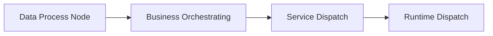
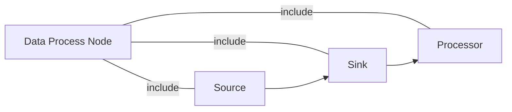

# 适用场景

应用于可持续发展、可编排、规模自由伸缩的企业级的数据领域

包含: 数据入域(录入、爬取、导库)、数据存储(HDFS、FastDFS、RMBMS、NoSQL)、数据分析、数据可视化端点

# 实现原理

抽象为四层: 

1、数据处理节点层(人的组成部分)

2、业务编排层(何人)

3、业务调度层(何时)

4、运行调度层(何地)

```mermaid
graph LR;
A[Data Process Node] -->B[Business Orchestrating];
B --> C[Service Dispatch];
C --> D[Runtime Dispatch];
```

```mermaid
graph LR;
A[Data Process Node] --include--- B[Source];
A --include--- C[Sink];
A --include--- D[Processor];
B --> C;
C --> D;
```

# 优点

# 缺点