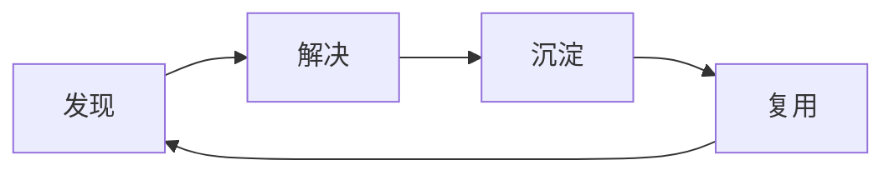

中台这个事情众说纷纷, 有先驱者, 先知先觉, 有后发者, 后知后觉

阿里从supercell公司得到最初灵感, 然后在国内开始布道, 实际上我看过几篇'阿里中台实际上并没有很成功'的文档

# 中台思考

## 中台的价值

### 前驱性

思路: 业务的源头的诞生于业务, 后续的人只是发现而不是发明, 后续的人只是重视而不是重现业务

落地: 鼓励使用者自我发现业务, 前移部分开发者着眼点到业务源头去改进业务

### 可塑性

思路: 与后台不一样的是, 中台必须为前台提供能够改变业务功能的方式

落地: 

​	提供个人空间, 允许尝试, 提高公平、公正、公开, 奖励并认可有价值的尝试

​	抽象已有形成元数据、数据、指令, 允许个人在个人的命名空间中修改元数据、数据、指令

​	提升开发工具的能力

​	组织内部人员需要更多价值观: 交付、开放、赋能、追求

### 先进性

思路: 发现问题之后必然要解决问题

落地: 加大技术投入, 记录问题, 按照技术进度解决问题

### 重复性

思路: 第1遍原始创造, 抽取第2遍发生的事情到中台上, 从中台上获取并填充到第3遍

落地: 鼓励第1遍创新, 抽取第2遍, 使用第2遍

### 融合性

思路: 1+1>2

落地:和其他产品/数据链接在一起, 产品/数据需要标准化、开放化

## 展现形式

### 组织架构

### 业务

### 产品

#### 前台

### 运营

#### 数据分析

### 技术

#### 系统

#### 数据
元数据

#### 算法

#### 中间件

#### 运维

​	

​	

