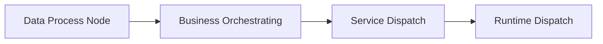
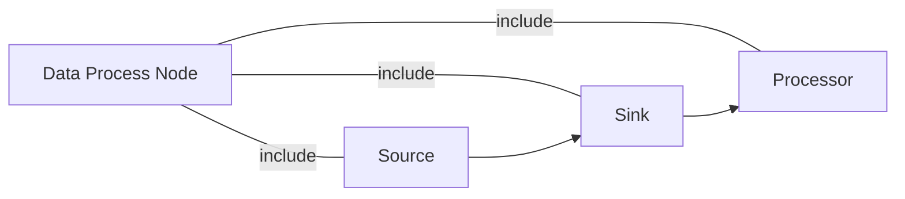

# 适用场景

应用于 编程化、 可视化、分布式 的企业级的数据领域

包含: 数据入域(录入、爬取、导库)、数据清洗、数据存储(HDFS、FastDFS、RMBMS、NoSQL)、数据分析、数据可视化端点

# 实现原理

抽象为四层: 

1、数据处理节点层(人的组成部分)

2、业务编排层(何人)

3、业务调度层(何时)

4、运行调度层(何地)



## 数据处理节点

由Source/Sink/Processor三个部分组成, 数据处理操作顺序如下:




## 业务编排

使用 DSL/WebUI 编排数据处理节点流转数据 实现 业务逻辑


## 业务调度

使用 Task Job Definition 触发执行业务编排任务


## 运行调度

 Batch/Steam

Skipper(SPI)


# 部署

## Docker方式

参考文档: https://dataflow.spring.io/docs/installation/local/docker/

涉及到的镜像:

```
mysql:5.7.25
confluentinc/cp-kafka:5.3.1
confluentinc/cp-zookeeper:5.3.1
springcloud/spring-cloud-dataflow-server:2.5.1.RELEASE
springcloud/openjdk:2.0.0.RELEASE
springcloud/spring-cloud-skipper-server:2.4.1.RELEASE
```

运行编排文件

```
curl https://raw.githubusercontent.com/spring-cloud/spring-cloud-dataflow/v2.5.1.RELEASE/spring-cloud-dataflow-server/docker-compose.yml -o docker-compose.yml

set DATAFLOW_VERSION=2.5.1.RELEASE
set SKIPPER_VERSION=2.4.1.RELEASE
docker-compose up
```

## Jar包方式

https://dataflow.spring.io/docs/installation/local/manual/

### 安装包

#### 镜像

```
rabbitmq:3.7.14-management
```

#### 文件

```bash
https://repo.spring.io/release/org/springframework/cloud/spring-cloud-skipper-server/2.4.1.RELEASE/spring-cloud-skipper-server-2.4.1.RELEASE.jar

https://repo.spring.io/release/org/springframework/cloud/spring-cloud-dataflow-server/2.5.1.RELEASE/spring-cloud-dataflow-server-2.5.1.RELEASE.jar

https://repo.spring.io/release/org/springframework/cloud/spring-cloud-dataflow-shell/2.5.1.RELEASE/spring-cloud-dataflow-shell-2.5.1.RELEASE.jar
```

### 运行

#### 部分网络情况下需要配置网络代理

```
-Dhttp.proxyHost=proxy.zte.com.cn -Dhttp.proxyPort=80 -Dhttps.proxyHost=proxy.zte.com.cn -Dhttps.proxyPort=80
```

#### 中间件

```
docker run -d --hostname rabbitmq --name rabbitmq -p 15672:15672 -p 5672:5672 rabbitmq:3.7.14-management
```

#### 运行时期调度器

```
java -jar spring-cloud-skipper-server-2.4.1.RELEASE.jar
```

#### data flow 后端

```
java -jar spring-cloud-dataflow-server-2.5.1.RELEASE.jar
```

#### data flow shell端点

```
java -jar spring-cloud-dataflow-shell-2.5.1.RELEASE.jar
```

# 使用

配置Application

https://dataflow.spring.io/docs/batch-developer-guides/batch/data-flow-simple-task/

如果因为网络情况不能使用 则请使用私有nexus库


配置Task

https://dataflow.spring.io/docs/batch-developer-guides/getting-started/task/


# 案例使用

## Task方式

可以在 https://repo.spring.io/libs-release-local/org/springframework/cloud/task/app/ 找到很多例子(jar包)

一个简单的案例

下载: https://repo.spring.io/libs-release-local/org/springframework/cloud/task/app/timestamp-task/1.1.0.RELEASE/timestamp-task-1.1.0.RELEASE.jar 到 F:\projects\github\tristan-tsl\some-docs-in-2020-master\springcloud-dataflow\example-task


创建APP 时设置URI的值为: file://F:/projects/github/tristan-tsl/some-docs-in-2020-master/springcloud-dataflow/example-task/timestamp-task-1.1.0.RELEASE.jar

创建Task, 启动Task

## Stream方式


# 访问

## DashBoard

http://localhost:9393/dashboard

## RestAPI

http://localhost:7577/api


# 优点

在微服务的思路下, 使得每一个数据分析操作都尽可能的微服务化


# 缺点

在含有大量历史包袱的情况下, 过于微服务并非是好事
